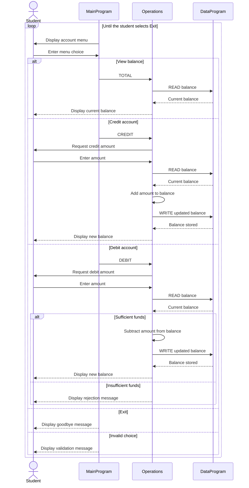

# COBOL Student Account System

This directory documents the COBOL programs in [`src/cobol`](../src/cobol). Together, the programs provide a command-line system for viewing and updating a student's account balance.

## Program Structure

The application is split into three programs:

1. `MainProgram` displays the menu and routes the user's selection.
2. `Operations` performs balance inquiries, credits, and debits.
3. `DataProgram` owns the in-memory account balance and handles reads and writes.

## COBOL Files

### `main.cob`

**Purpose:** Provides the application entry point and interactive account-management menu.

**Key functions:**

- Repeats the menu until the user selects option `4`.
- Accepts a single-digit menu choice from `1` through `4`.
- Calls `Operations` with a fixed-width operation code:
  - `TOTAL`, padded with one trailing space, to view the current balance.
  - `CREDIT` to add funds.
  - `DEBIT`, padded with one trailing space, to remove funds.
- Displays an error when the choice is outside the supported menu options.

### `operations.cob`

**Purpose:** Implements the account transactions selected by the user.

**Key functions:**

- **View balance:** Reads the current balance from `DataProgram` and displays it.
- **Credit account:** Accepts an amount, adds it to the current balance, saves the result, and displays the new balance.
- **Debit account:** Accepts an amount, verifies sufficient funds, subtracts and saves the amount when allowed, and displays the result.
- Uses `DataProgram` for every balance read and write so balance storage remains separate from transaction logic.

### `data.cob`

**Purpose:** Acts as the account balance store for the running process.

**Key functions:**

- Initializes the stored balance to `1000.00`.
- Handles `READ` by copying the stored balance to the caller.
- Handles `WRITE` by replacing the stored balance with the caller's balance.
- Keeps the balance in working storage; it does not use a file or database.

## Student Account Business Rules

- A student account starts with a balance of `1000.00` each time the application starts.
- Credits increase the balance by the full amount entered.
- Debits are approved only when the current balance is greater than or equal to the requested amount.
- A rejected debit does not change the balance and displays `Insufficient funds for this debit.`
- Balances and transaction amounts use `PIC 9(6)V99`, supporting non-negative values with up to six whole-number digits and two decimal places.
- The system manages one shared balance at a time; it has no student identifier or support for multiple accounts.
- Balance changes exist only while the process is running. Exiting and restarting resets the balance to `1000.00`.
- The current implementation does not explicitly validate malformed amounts, enforce a minimum transaction amount, or guard against a credit exceeding the numeric field size.

## Operation Flow

